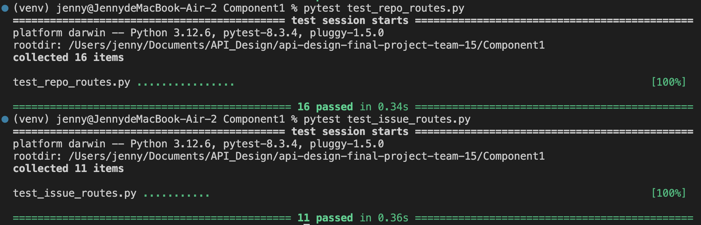

## Overview

I implemented Component 1 with **RESTful API** in **Python** and **Flask**.

## API Design Table

| Capability                             | Verb  | Endpoint                                                    | Endpoint Description                                                       | Participants | Input                                 | Output and Response Codes                                                                                                                                   |
|----------------------------------------|-------|-------------------------------------------------------------|-----------------------------------------------------------------------------|--------------|---------------------------------------|-------------------------------------------------------------------------------------------------------------------------------------------------------------|
| Get repository default view            | GET   | /repositories/{id}                                         | Redirect to the latest commit on the main branch.                           | User         | {id} (repository ID)                 | 200 OK: Return the repository information and the latest commit information in the main branch 404 Not Found: Repository not found.                       |
| Navigate to commits in the main branch | GET   | /repositories/{id}/branches/main/commits                   | Retrieve all commits in the main branch of the repository.                  | User         | {id}                                 | 200 OK: Returns a list of commits. 404 Not Found: Repository or main branch not found.                                                                    |
| Select commit by hash                  | GET   | /repositories/{id}/commits/{hash}                          | Select commit by hash.                                                     | User         | {id}, {hash}                         | 200 OK: Returns commit information. 404 Not Found: Repository or commit not found.                                                                        |
| List all branches                      | GET   | /repositories/{id}/branches                                | Retrieve all branches in the specified repository.                          | User         | {id}                                 | 200 OK: Returns a list of branches. 404 Not Found: Repository not found.                                                                                   |
| List all tags                          | GET   | /repositories/{id}/tags                                    | Retrieve all tags in the specified repository.                              | User         | {id}                                 | 200 OK: Returns a list of tags. 404 Not Found: Repository not found.                                                                                       |
| List all commits in a branch           | GET   | /repositories/{id}/branches/{branch}/commits               | Retrieve all commits in the specified branch of the repository.             | User         | {id}, {branch}                       | 200 OK: Returns a list of commits. 404 Not Found: Repository or branch not found.                                                                          |
| Get top-level tree in a commit         | GET   | /repositories/{id}/branches/{branch}/commits/{hash}/tree   | Retrieve the top-level directory tree for the specified commit in the repository. | User         | {id}, {branch}, {hash}               | 200 OK: Returns the directory tree structure. 404 Not Found: Repository, branch, or commit not found.                                                     |
| View file or sub-tree                  | GET   | /repositories/{id}/branches/{branch}/commits/{hash}/tree/{path} | Retrieve file content or subdirectory list based on the given path in the commit. | User         | {id}, {branch}, {hash}, {path}       | 200 OK: Returns file content or directory structure. 404 Not Found: File or directory not found.                                                          |
| List repository issues                 | GET   | /repositories/{id}/issues                                  | Retrieve a list of issues in the repository, with optional filtering by status and pagination. | User         | {id} (required), {status}, {page}, {size} (optional) | 200 OK: Returns a list of issues with status and submitter ID. 404 Not Found: Repository not found.                                                       |
| View a specific issue details          | GET   | /repositories/{id}/issues/{issue_id}                       | Retrieve detailed information about a specific issue, including its description and comments. | User         | {id}, {issue_id}                     | 200 OK: Returns issue details and one page of comments. 404 Not Found: Repository or issue not found.                                                     |
| Report a new issue                     | POST  | /repositories/{id}/issues                                  | Create a new issue in the repository. All new issues are Open by default.   | User         | {id}, {description}, {submitterId}  | 201 Created: Issue created successfully. 400 Bad Request: Invalid input: no issue description or submitter_id. 404 Not Found: Repository not found.     |
| Paginate comments for an issue         | GET   | /repositories/{id}/issues/{issue_id}/comments              | Retrieve paginated comments for a specific issue. Comments are ordered by date. | User         | {id}, {issue_id}, {page}, {size}     | 200 OK: Returns a paginated list of comments. 400 Bad Request: Invalid input of page and size. 404 Not Found: Repository or issue not found.            |
| Submit a new comment                   | POST  | /repositories/{id}/issues/{issue_id}/comments              | Submit a new comment for a specific issue.                                  | User         | {id}, {issue_id}, {comment}          | 201 Created: Comment added successfully. 400 Bad Request: Invalid input: no commit content. 404 Not Found: Repository or issue not found.              |

---

## Testing

For each API functionality, I implemented **unit tests** using `pytest`. Each test includes a **happy path test** and an **error test**.

All tests have successfully passed, as shown below:

